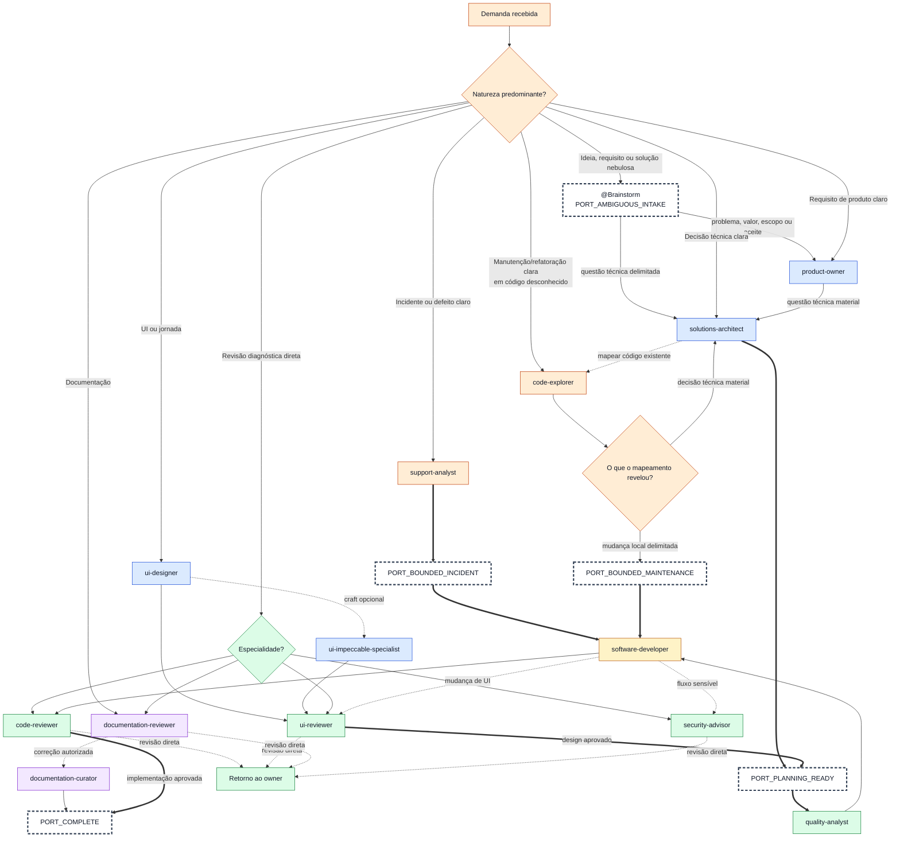
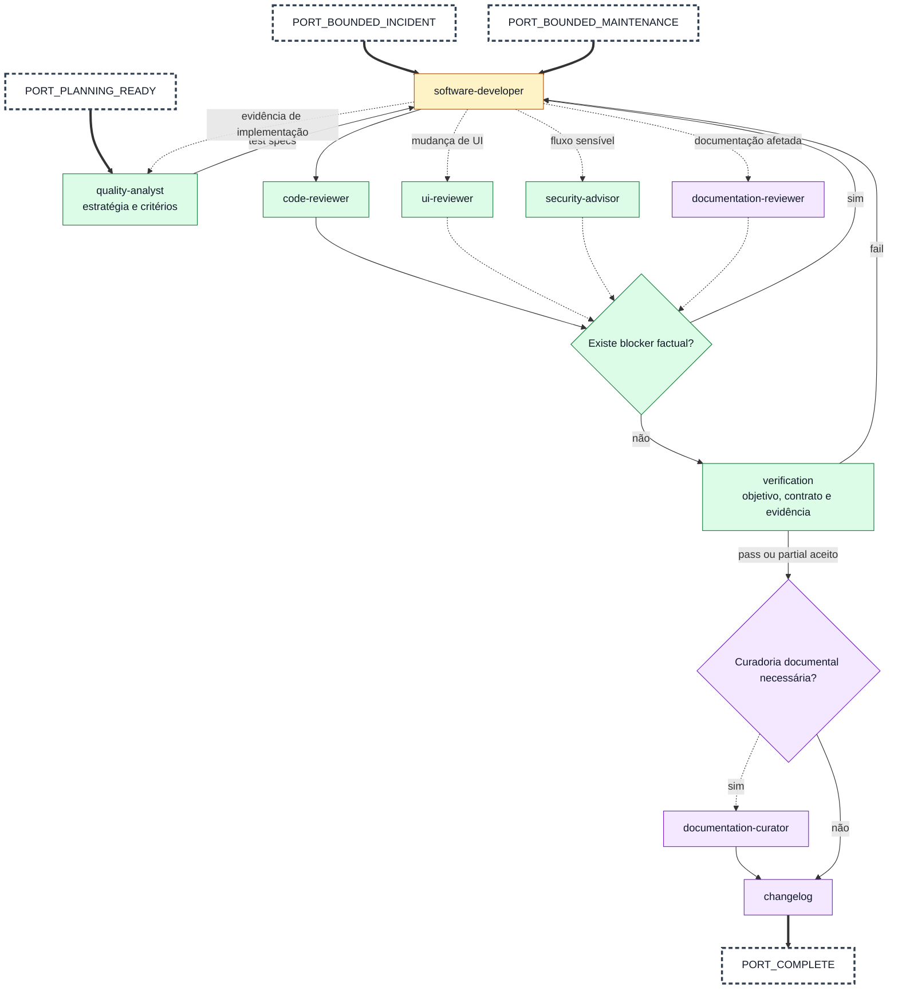

# Agent Workflow

## Operational Outcome Lock

When an explicitly requested or authorized operational outcome is still unresolved, keep that
outcome ahead of internal engineering work. A code change is an unblocker only when it addresses the
observed blocker directly and the existing governed path cannot safely complete the operation.

Use this fallback ladder once per distinct failure hypothesis:

1. Try the existing governed path.

2. Run one bounded diagnostic pass that preserves the first causal error and changes the next
   hypothesis.

3. Offer or use an authorized operational fallback that stays within the approved target and
   mutation boundary.

4. Stop with the blocker and exact next action when neither path is safe or authorized.

Do not repeat an equivalent attempt without new evidence. Passing tests, a ready changeset, or new
documentation does not close the operational request; only the requested state plus its validation
evidence does.

Before adding a new command or package, changing another package, or starting a broad refactor while
the outcome remains open, run a scope-expansion checkpoint. Record the unresolved outcome, concrete
blocker, narrow fallback, proposed expansion, and why the expansion is necessary. Continue only
after explicit approval; otherwise finish through the narrow path or stop.

## Scope Integrity Lock

For multi-item work, maintain a lightweight scope ledger:

- `total_universe`: every item still covered by the requested or authorized outcome;
- `focus_subset`: the items currently being inspected, discussed, or prioritized;
- `restriction_source`: `explicit_user`, `tool_constraint`, or `analysis_only`;
- `unresolved_remainder`: every item outside the focus that still belongs to the total universe.

A focus subset never replaces the total universe by implication. A user question about some items, a
tool result limited to those items, or a temporary diagnostic branch changes focus only. Narrow the
authorized universe only when the user explicitly excludes, defers, cancels, or replaces items.

Before a recommendation, mutation, delegation, or close-out changes the target set:

1. Reconcile the planned targets with the current `total_universe`.

2. If the target set expands, use the existing scope-expansion checkpoint.

3. If it contracts, name the omitted `unresolved_remainder` and obtain explicit user direction
   before dropping or deferring it.

4. After bounded tool output, preserve items the tool did not inspect unless that tool was the
   authoritative source for the complete universe.

Surface the ledger in chat only when it resolves ambiguity or affects an operational decision. The
ledger is a reasoning guardrail, not a requirement to add ceremony to simple single-item work.

## Prompt map and when to use each one

The prompts below live under `.agents/prompts/`.

### 1. `bug-analysis.prompt.md`

Use when:

- there is a bug
- behavior diverges from expectation
- an incident or failure needs root cause analysis
- a critical, live, or production-like failure needs disciplined technical debugging
- a correction should only be proposed after diagnosis

Purpose:

- reconstruct context
- compare expected flow versus actual flow
- rank hypotheses
- validate before proposing a fix
- identify hidden edge cases and control scenarios
- recommend the minimal effective correction

Boundary note:

- this prompt is the local diagnostic entrypoint of the repository

- if the project persists bug analyses beyond the current session, versioned case records belong in
  `.agents/bug-analysis/`

- use `.agents/templates/bug-analysis.template.md` when materializing those versioned records

- do not confuse the prompt with the versioned artifact store

### 2. `solution-design.prompt.md`

Use when:

- there are multiple legitimate technical approaches and the best one is not obvious
- the choice of approach has architectural, operational, or maintainability consequences
- committing to the wrong approach would be costly to reverse
- a previous implementation attempt failed and the approach itself needs to be reconsidered

Do not use when:

- the approach is obvious and uncontested (go straight to implementation-planning)
- the task is a bug fix with a clear root cause (use bug-analysis)
- the decision is purely about execution order (use implementation-planning)

Purpose:

- evaluate technical alternatives with explicit criteria
- compare approaches based on repository evidence and constraints
- produce a grounded design decision with clear rationale
- deliver a contract that implementation-planning consumes as input

### 2a. `architecture-decision.prompt.md`

Use when:

- the user asks to create, update, review, or consult an ADR

- a decision should be recorded before implementation as a proposed ADR

- a refactoring, incident, bug analysis, code review, or changelog surfaced a durable architectural
  decision

- an existing ADR may need to be updated instead of creating a duplicate

Do not use when:

- the decision is tactical, stylistic, local, or cheap to reverse
- the right output is only a changelog entry, work-item, or local refactoring record
- the decision is still too ambiguous to identify alternatives and consequences

Purpose:

- decide between `não criar ADR`, `criar ADR proposto`, `criar ADR aceito`, `atualizar ADR
  existente`, or `consultar ADR existente`

- use `.agents/templates/architecture-decision.template.md` and the repository ADR convention

- prevent ADR duplication by scanning existing `docs/architecture-decisions/` records first

- support both pre-implementation ADRs and post-execution promotion from refactoring or other
  evidence

### 2b. `brainstorm.prompt.md`

Use when:

- the user directly invokes `@Brainstorm`

- an idea, requirement, or solution is unclear and needs guided discovery before a handoff to
  `product-owner` or `solutions-architect`

Do not use when:

- the user asks only for one artifact and already selected its canonical workflow

- the user asks to implement, deploy, or mutate state without first asking for solution-cycle
  guidance

- wording merely resembles idea discovery without the direct first-version trigger

- the case is a clear incident (use `support-analyst`) or clear maintenance/refactoring in unknown
  code (use `code-explorer`)

Purpose:

- keep one controller responsible for state, correlation, provenance, and operator checkpoints

- route the framed input first to Product Owner or Solutions Architect; never use the controller as
  an automatic support or code-exploration router

- finish with a reviewed solution contract and separate execution handoff

### 2c. `council-of-agents.prompt.md`

Use when:

- the user asks for `council this`, `pressure test this`, `stress test this`, `war room this`,
  `premortem this`, `debate this`, `council of agents`, or directly invokes `@Council of Agents`

- there is a genuine decision with stakes, uncertainty, and competing options

- independent perspectives and anonymous peer review would materially improve the final
  recommendation

Do not use when:

- the question has one factual answer
- the task is ordinary implementation or content generation

### 2d. `agents-of-shield.prompt.md`

Use when:

- the user invokes `@Agents of Shield` or says `agents of shield`
- the security question benefits from the fixed five security profiles
- the output should remain diagnostic, sanitized, and advisory

Do not use when:

- the user asks for a single `security-advisor` profile

- the user asks for code fixes, credential rotation, deployment, or external mutation without a
  separate explicit handoff

### 2e. `fellowship-of-architects.prompt.md`

Use when:

- the user invokes `@Fellowship of Architects` or says `fellowship of architects`
- the architecture question benefits from the fixed five architecture profiles
- the output should compare trade-offs, ADR implications, refactoring direction, and next steps

Do not use when:

- the user asks for a single `solutions-architect` profile
- the user asks for implementation or ADR writing without a separate bounded handoff
- the user asks for team-mode execution rather than decision pressure testing

Purpose:

- frame the decision with relevant workspace context
- run five advisor lenses independently
- anonymize advisor outputs for peer review
- synthesize a clear Chairman verdict and one first action
- produce `council-report-[timestamp].html` and `council-transcript-[timestamp].md`

### 3. `implementation-planning.prompt.md`

Use when:

- the task is non-trivial
- the change involves multiple steps, files, or modules
- there is migration, rollout, or architectural risk
- you want a disciplined execution plan before implementation
- the plan may later be delegated to Codex, Claude, or another coding agent

Purpose:

- define scope
- identify assumptions and constraints
- map risks and dependencies
- produce a sequenced plan
- define validation and rollback

Operational rule:

- whenever entering or activating planning mode, use
  `.agents/prompts/implementation-planning.prompt.md` as the output contract!

- when the workflow enters the planning phase for a non-trivial task, read
  `.agents/prompts/implementation-planning.prompt.md` before producing the plan

- if the environment provides a native Planning Mode, use that mode as execution posture, but treat
  `.agents/prompts/implementation-planning.prompt.md` as the repository-specific contract for
  planning scope, structure, constraints, and output

- do not assume native Planning Mode alone satisfies this requirement; the local planning prompt
  must still be consumed

### 4. `test-driven.prompt.md`

Use when:

- an implementation plan exists and the next step is writing code
- behavior must be precisely defined before implementation begins
- the task involves business logic, data transformation, or integration contracts
- edge cases and failure modes need explicit attention
- the implementation will be executed by a coding agent that benefits from verifiable targets
- legacy code is being changed and the current behavior needs to be stabilized before modification

Do not use when:

- the task is purely infrastructure or configuration with no testable behavior
- the change is a one-line fix with an obvious expected outcome
- there are no existing testing conventions and setting them up is out of scope

Purpose:

- specify expected behavior before code is written

- define test cases as the contract the implementation must satisfy

- identify edge cases, failure modes, and boundary conditions upfront

- produce a coverage matrix that highlights intentional gaps

- flag open questions where behavior cannot be specified without clarification

- for legacy code: assess testability and adapt strategy (characterization, boundary, or change-only
  testing)

Tests are design artifacts, not verification artifacts. For legacy code with low testability, the
prompt adapts its strategy rather than forcing classical test-first.

### 5. `verification.prompt.md`

Use when:

- a non-trivial implementation has been completed and the next step is documentation
- the change involved multiple steps, files, or components where drift is plausible
- a refactor carries risk of silent deviation between plan and result
- a bug fix passed tests but "passing tests" alone does not prove the root cause was resolved
- the implementation was delegated to a coding agent and the output needs verification

Do not use when:

- the change is trivial and local (one file, obvious outcome)
- the change is purely documental (no implementation to verify)
- the validation is already self-evident and proportionally cheap

Purpose:

- compare the implemented result against the original objective, design contract, plan, and test
  specs

- identify scope deviations, validation gaps, and probable regressions

- classify deviations as decided (justified, documented) or silent (unjustified)

- emit a verdict: pass | partial | fail

- determine whether the workflow proceeds to documentation or returns to execution

Passing tests proves conformance with specifications. Verification proves alignment with intent.

### 6. `subagent-execution.prompt.md`

Use when:

- the task has multiple independent fronts
- logs, code, and documentation benefit from parallel analysis
- multiple approaches must be compared
- root cause analysis has several strong competing hypotheses
- a refactor affects clearly distinct modules
- implementation, documentation, and validation can be reviewed in parallel

Do not use when:

- the task is straightforward
- there is a single clear linear flow
- decomposition adds more overhead than value
- the context must remain centralized
- the reasoning depends on sequential analysis

Purpose:

- decide whether subagents are justified
- define the minimum useful decomposition
- prevent overlap
- define consolidation rules

Subagents are an optional strategy, not the default mode.

### 7. `changelog.prompt.md`

Use when:

- relevant technical work happened
- context needs to be compacted
- a session needs a factual operational record
- continuity must be preserved for a future session

Purpose:

- register what happened
- preserve useful evidence and decisions
- avoid logging irrelevant conversation
- maintain a short, structured operational memory

### 8. `readme.prompt.md`

Use when:

- a technical change may affect `README.md`
- setup, commands, environment variables, usage, or workflow may have changed
- you need a strict review of whether documentation should change at all

Purpose:

- determine whether the `README.md` is actually affected
- propose only minimal, factual updates
- reject speculative or decorative documentation changes
- recommend a better destination if README is not the right place

### 9. `knowledge-base.prompt.md`

Use when:

- changelogs should be consolidated into durable knowledge

- notes should be created, updated, or merged in the versioned knowledge base referenced by
  `OBSIDIAN.md` when present, or in the repository's canonical documentation location

- the curated `OBSIDIAN.md`, when used by the repository, needs localized updates

- recurring patterns, decisions, or runbooks should be promoted

Purpose:

- filter durable knowledge from factual records
- avoid redundancy
- update existing notes before creating new ones
- keep the knowledge base coherent and navigable

### 10. `repository-overview.prompt.md`

Use when:

- a non-technical audience needs to understand what the repository delivers

- `REPOSITORY-OVERVIEW.md` should be created, reviewed, or refreshed

- a functional, business-oriented repository description is needed without turning `README.md` or
  `OBSIDIAN.md` into the wrong document

Purpose:

- produce or update `REPOSITORY-OVERVIEW.md`

- keep `OBSIDIAN.md` as a localized navigational index, not as the overview itself

- preserve a clear distinction between repository description, knowledge base, and functional
  overview

---

## Typical prompt sequence

For non-trivial tasks with real local continuity risk, create or resume a local work item in
`.agents/work-items/` before entering the sequence below. Typical triggers: context compaction risk,
pause or handoff, observational investigation, local artifacts, or material skip/deviation tracking.

### For a complex bug

1. `bug-analysis.prompt.md`

2. `solution-design.prompt.md` if the fix requires choosing between approaches

3. `architecture-decision.prompt.md` if the chosen fix introduces or changes an architectural
   decision worth recording

4. `implementation-planning.prompt.md` if the fix is non-trivial

5. `test-driven.prompt.md` to specify expected behavior before coding the fix

6. `subagent-execution.prompt.md` only if parallel decomposition adds value

7. execute the work

8. `verification.prompt.md` to confirm the result satisfies the objective, design, and specs

9. `changelog.prompt.md`

10. `readme.prompt.md` if technical behavior may affect `README.md`

11. `knowledge-base.prompt.md` later, during consolidation

12. `repository-overview.prompt.md` only if the non-technical repository explanation needs to change

### For a feature, migration, or refactor

1. `solution-design.prompt.md` when there are multiple viable approaches

2. `architecture-decision.prompt.md` when the design should be recorded before implementation or
   promoted after execution

3. `implementation-planning.prompt.md`

4. `test-driven.prompt.md` to specify behavior before implementation

5. `subagent-execution.prompt.md` only if justified

6. execute the work

7. `verification.prompt.md` to confirm the result satisfies the objective, design, and specs

8. `changelog.prompt.md`

9. `readme.prompt.md`

10. `knowledge-base.prompt.md` later, if the change generates durable knowledge

11. `repository-overview.prompt.md` when the functional, non-technical description of the repository
    changes materially

## Contrato visual dos agentes

Os três Mermaid são visões coordenadas do mesmo sistema, não alternativas concorrentes. O macro
roteamento é a única visão que classifica a demanda inicial; o ciclo do Brainstorm expande somente
`PORT_AMBIGUOUS_INTAKE`; entrega e assurance começam somente após trabalho delimitado. As portas
mantêm os mesmos IDs em todas as visões.

<!-- BEGIN AGENT DIAGRAM CONTRACT -->

```json
{
  "schema_version": 1,
  "edge_semantics": {
    "-->": "ownership-or-state-transition",
    "-.->": "consultation-evidence-return-or-optional-gate",
    "==>": "cross-diagram-port-continuation"
  },
  "ports": {
    "PORT_AMBIGUOUS_INTAKE": {
      "producer_diagrams": [
        "agent-routing"
      ],
      "consumer_diagrams": [
        "brainstorm-cycle"
      ]
    },
    "PORT_BOUNDED_INCIDENT": {
      "producer_diagrams": [
        "agent-routing",
        "brainstorm-cycle"
      ],
      "consumer_diagrams": [
        "delivery-assurance"
      ]
    },
    "PORT_BOUNDED_MAINTENANCE": {
      "producer_diagrams": [
        "agent-routing",
        "brainstorm-cycle"
      ],
      "consumer_diagrams": [
        "delivery-assurance"
      ]
    },
    "PORT_PLANNING_READY": {
      "producer_diagrams": [
        "agent-routing",
        "brainstorm-cycle"
      ],
      "consumer_diagrams": [
        "delivery-assurance"
      ]
    },
    "PORT_COMPLETE": {
      "producer_diagrams": [
        "agent-routing",
        "delivery-assurance"
      ],
      "consumer_diagrams": []
    }
  },
  "diagram_responsibilities": {
    "agent-routing": [
      "initial-classification",
      "first-owner",
      "direct-review-entry",
      "macro-handoffs"
    ],
    "brainstorm-cycle": [
      "ambiguous-intake",
      "controller-state",
      "artifact-and-review-gates"
    ],
    "delivery-assurance": [
      "implementation",
      "quality",
      "specialist-review",
      "verification",
      "documentation-closeout"
    ]
  }
}
```

<!-- END AGENT DIAGRAM CONTRACT -->

### Legenda comum

- `-->`: transfere ownership ou avança um estado dentro da mesma visão;
- `-.->`: consulta, devolve evidência ou executa um gate opcional sem transferir ownership;
- `==>`: atravessa uma porta nomeada para continuar em outro Mermaid;
- laranja: descoberta e classificação;
- azul: produto, arquitetura e design;
- amarelo: implementação;
- verde: qualidade e revisão;
- roxo: documentação e encerramento;
- contorno tracejado espesso: porta compartilhada.

### 1. Macro roteamento de agentes

Esta é a única visão autorizada a classificar a demanda inicial. Ela mostra todos os agentes e os
encadeamentos típicos; detalhes do Brainstorm e da entrega pertencem aos Mermaid seguintes.

<!-- BEGIN AGENT ROUTING MERMAID -->



<!-- END AGENT ROUTING MERMAID -->

### 2. Ciclo interno do Brainstorm

O drill-down de `PORT_AMBIGUOUS_INTAKE` está em `.agents/references/brainstorm.md`. Ele mantém o
controller até um estado terminal e só transfere o primeiro ownership para `product-owner` ou
`solutions-architect`. Incidentes e manutenção clara são reclassificados para as portas de entrega,
sem investigação pelo Brainstorm.

### 3. Entrega e assurance

Esta visão começa exclusivamente nas portas de trabalho delimitado. Ela não classifica demanda,
não contém Brainstorm, Product Owner ou Solutions Architect e não redefine decisões de solução.

<!-- BEGIN DELIVERY ASSURANCE MERMAID -->



<!-- END DELIVERY ASSURANCE MERMAID -->

As portas não autorizam execução por si mesmas: apenas preservam o tipo de handoff entre as visões.
Um retorno `fail` ou blocker factual volta ao owner de implementação; mudança de escopo ou solução
retorna ao owner upstream conforme os contratos de roteamento e revisão.
