# Agent Workflow

## Prompt map and when to use each one

The prompts below live under `.agents/prompts/`.

### 1. `bug-analysis.prompt.md`

Use when:

- there is a bug
- behavior diverges from expectation
- an incident or failure needs root cause analysis
- a critical, live, or production-like failure needs disciplined technical debugging
- a correction should only be proposed after diagnosis

Purpose:

- reconstruct context
- compare expected flow versus actual flow
- rank hypotheses
- validate before proposing a fix
- identify hidden edge cases and control scenarios
- recommend the minimal effective correction

Boundary note:

- this prompt is the local diagnostic entrypoint of the repository

- if the project persists bug analyses beyond the current session, versioned case records belong in
  `.agents/bug-analysis/`

- use `.agents/templates/bug-analysis.template.md` when materializing those versioned records

- do not confuse the prompt with the versioned artifact store

### 2. `solution-design.prompt.md`

Use when:

- there are multiple legitimate technical approaches and the best one is not obvious
- the choice of approach has architectural, operational, or maintainability consequences
- committing to the wrong approach would be costly to reverse
- a previous implementation attempt failed and the approach itself needs to be reconsidered

Do not use when:

- the approach is obvious and uncontested (go straight to implementation-planning)
- the task is a bug fix with a clear root cause (use bug-analysis)
- the decision is purely about execution order (use implementation-planning)

Purpose:

- evaluate technical alternatives with explicit criteria
- compare approaches based on repository evidence and constraints
- produce a grounded design decision with clear rationale
- deliver a contract that implementation-planning consumes as input

### 2a. `architecture-decision.prompt.md`

Use when:

- the user asks to create, update, review, or consult an ADR

- a decision should be recorded before implementation as a proposed ADR

- a refactoring, incident, bug analysis, code review, or changelog surfaced a durable architectural
  decision

- an existing ADR may need to be updated instead of creating a duplicate

Do not use when:

- the decision is tactical, stylistic, local, or cheap to reverse
- the right output is only a changelog entry, work-item, or local refactoring record
- the decision is still too ambiguous to identify alternatives and consequences

Purpose:

- decide between `não criar ADR`, `criar ADR proposto`, `criar ADR aceito`, `atualizar ADR
  existente`, or `consultar ADR existente`

- use `.agents/templates/architecture-decision.template.md` and the repository ADR convention

- prevent ADR duplication by scanning existing `docs/architecture-decisions/` records first

- support both pre-implementation ADRs and post-execution promotion from refactoring or other
  evidence

### 2b. `council-of-agents.prompt.md`

Use when:

- the user asks for `council this`, `pressure test this`, `stress test this`, `war room this`,
  `premortem this`, `debate this`, `council of agents`, `fellowship of agents`, or directly invokes
  `@Council of Agents` or `@Fellowship of Agents`

- there is a genuine decision with stakes, uncertainty, and competing options

- independent perspectives and anonymous peer review would materially improve the final
  recommendation

Do not use when:

- the question has one factual answer
- the task is ordinary implementation or content generation
- the user asks for team-mode execution rather than decision pressure testing

Purpose:

- frame the decision with relevant workspace context
- run five advisor lenses independently
- anonymize advisor outputs for peer review
- synthesize a clear Chairman verdict and one first action
- produce `council-report-[timestamp].html` and `council-transcript-[timestamp].md`

### 3. `implementation-planning.prompt.md`

Use when:

- the task is non-trivial
- the change involves multiple steps, files, or modules
- there is migration, rollout, or architectural risk
- you want a disciplined execution plan before implementation
- the plan may later be delegated to Codex, Claude, or another coding agent

Purpose:

- define scope
- identify assumptions and constraints
- map risks and dependencies
- produce a sequenced plan
- define validation and rollback

Operational rule:

- whenever entering or activating planning mode, use
  `.agents/prompts/implementation-planning.prompt.md` as the output contract!

- when the workflow enters the planning phase for a non-trivial task, read
  `.agents/prompts/implementation-planning.prompt.md` before producing the plan

- if the environment provides a native Planning Mode, use that mode as execution posture, but treat
  `.agents/prompts/implementation-planning.prompt.md` as the repository-specific contract for
  planning scope, structure, constraints, and output

- do not assume native Planning Mode alone satisfies this requirement; the local planning prompt
  must still be consumed

### 4. `test-driven.prompt.md`

Use when:

- an implementation plan exists and the next step is writing code
- behavior must be precisely defined before implementation begins
- the task involves business logic, data transformation, or integration contracts
- edge cases and failure modes need explicit attention
- the implementation will be executed by a coding agent that benefits from verifiable targets
- legacy code is being changed and the current behavior needs to be stabilized before modification

Do not use when:

- the task is purely infrastructure or configuration with no testable behavior
- the change is a one-line fix with an obvious expected outcome
- there are no existing testing conventions and setting them up is out of scope

Purpose:

- specify expected behavior before code is written

- define test cases as the contract the implementation must satisfy

- identify edge cases, failure modes, and boundary conditions upfront

- produce a coverage matrix that highlights intentional gaps

- flag open questions where behavior cannot be specified without clarification

- for legacy code: assess testability and adapt strategy (characterization, boundary, or change-only
  testing)

Tests are design artifacts, not verification artifacts. For legacy code with low testability, the
prompt adapts its strategy rather than forcing classical test-first.

### 5. `verification.prompt.md`

Use when:

- a non-trivial implementation has been completed and the next step is documentation
- the change involved multiple steps, files, or components where drift is plausible
- a refactor carries risk of silent deviation between plan and result
- a bug fix passed tests but "passing tests" alone does not prove the root cause was resolved
- the implementation was delegated to a coding agent and the output needs verification

Do not use when:

- the change is trivial and local (one file, obvious outcome)
- the change is purely documental (no implementation to verify)
- the validation is already self-evident and proportionally cheap

Purpose:

- compare the implemented result against the original objective, design contract, plan, and test
  specs

- identify scope deviations, validation gaps, and probable regressions

- classify deviations as decided (justified, documented) or silent (unjustified)

- emit a verdict: pass | partial | fail

- determine whether the workflow proceeds to documentation or returns to execution

Passing tests proves conformance with specifications. Verification proves alignment with intent.

### 6. `subagent-execution.prompt.md`

Use when:

- the task has multiple independent fronts
- logs, code, and documentation benefit from parallel analysis
- multiple approaches must be compared
- root cause analysis has several strong competing hypotheses
- a refactor affects clearly distinct modules
- implementation, documentation, and validation can be reviewed in parallel

Do not use when:

- the task is straightforward
- there is a single clear linear flow
- decomposition adds more overhead than value
- the context must remain centralized
- the reasoning depends on sequential analysis

Purpose:

- decide whether subagents are justified
- define the minimum useful decomposition
- prevent overlap
- define consolidation rules

Subagents are an optional strategy, not the default mode.

### 7. `changelog.prompt.md`

Use when:

- relevant technical work happened
- context needs to be compacted
- a session needs a factual operational record
- continuity must be preserved for a future session

Purpose:

- register what happened
- preserve useful evidence and decisions
- avoid logging irrelevant conversation
- maintain a short, structured operational memory

### 8. `readme.prompt.md`

Use when:

- a technical change may affect `README.md`
- setup, commands, environment variables, usage, or workflow may have changed
- you need a strict review of whether documentation should change at all

Purpose:

- determine whether the `README.md` is actually affected
- propose only minimal, factual updates
- reject speculative or decorative documentation changes
- recommend a better destination if README is not the right place

### 9. `knowledge-base.prompt.md`

Use when:

- changelogs should be consolidated into durable knowledge

- notes should be created, updated, or merged in the versioned knowledge base referenced by
  `OBSIDIAN.md` when present, or in the repository's canonical documentation location

- the curated `OBSIDIAN.md`, when used by the repository, needs localized updates

- recurring patterns, decisions, or runbooks should be promoted

Purpose:

- filter durable knowledge from factual records
- avoid redundancy
- update existing notes before creating new ones
- keep the knowledge base coherent and navigable

### 10. `repository-overview.prompt.md`

Use when:

- a non-technical audience needs to understand what the repository delivers

- `REPOSITORY-OVERVIEW.md` should be created, reviewed, or refreshed

- a functional, business-oriented repository description is needed without turning `README.md` or
  `OBSIDIAN.md` into the wrong document

Purpose:

- produce or update `REPOSITORY-OVERVIEW.md`

- keep `OBSIDIAN.md` as a localized navigational index, not as the overview itself

- preserve a clear distinction between repository description, knowledge base, and functional
  overview

---

## Typical prompt sequence

For non-trivial tasks with real local continuity risk, create or resume a local work item in
`.agents/work-items/` before entering the sequence below. Typical triggers: context compaction risk,
pause or handoff, observational investigation, local artifacts, or material skip/deviation tracking.

### For a complex bug

1. `bug-analysis.prompt.md`

2. `solution-design.prompt.md` if the fix requires choosing between approaches

3. `architecture-decision.prompt.md` if the chosen fix introduces or changes an architectural
   decision worth recording

4. `implementation-planning.prompt.md` if the fix is non-trivial

5. `test-driven.prompt.md` to specify expected behavior before coding the fix

6. `subagent-execution.prompt.md` only if parallel decomposition adds value

7. execute the work

8. `verification.prompt.md` to confirm the result satisfies the objective, design, and specs

9. `changelog.prompt.md`

10. `readme.prompt.md` if technical behavior may affect `README.md`

11. `knowledge-base.prompt.md` later, during consolidation

12. `repository-overview.prompt.md` only if the non-technical repository explanation needs to change

### For a feature, migration, or refactor

1. `solution-design.prompt.md` when there are multiple viable approaches

2. `architecture-decision.prompt.md` when the design should be recorded before implementation or
   promoted after execution

3. `implementation-planning.prompt.md`

4. `test-driven.prompt.md` to specify behavior before implementation

5. `subagent-execution.prompt.md` only if justified

6. execute the work

7. `verification.prompt.md` to confirm the result satisfies the objective, design, and specs

8. `changelog.prompt.md`

9. `readme.prompt.md`

10. `knowledge-base.prompt.md` later, if the change generates durable knowledge

11. `repository-overview.prompt.md` when the functional, non-technical description of the repository
    changes materially

### Workflow visual

```mermaid
flowchart TD
    START{Task type}
    START -->|Bug / Incident| BA["🔍 bug-analysis"]
    START -->|Feature / Refactor| DESIGN_GATE
    BA --> DESIGN_GATE{Multiple\napproaches?}
    DESIGN_GATE -->|Yes| SD["🏗️ solution-design"]
    DESIGN_GATE -->|" Obvious approach "| PLAN_GATE
    SD --> ADR_GATE{ADR needed?}
    ADR_GATE -->|Yes| ADR["🏛️ architecture-decision"]
    ADR_GATE -->|No| IP["📋 implementation-planning"]
    ADR -- " ADR decision " --> IP
    PLAN_GATE{Non-trivial\ntask?}
    PLAN_GATE -->|Yes| IP
    PLAN_GATE -->|" Trivial "| EXEC
    IP -- " execution plan " --> TDP["🧪 test-driven"]
    TDP -- " test specs " --> PARALLEL_GATE{Independent\nfronts?}
    PARALLEL_GATE -->|Yes| SE["🔀 subagent-execution"]
    PARALLEL_GATE -->|No| EXEC
    SE --> EXEC["⚡ Execution"]
    EXEC --> VERIFY_GATE{Non-trivial\nchange?}
    VERIFY_GATE -->|Yes| VER["✔️ verification"]
    VERIFY_GATE -->|" Trivial "| CL
    VER -->|" pass / partial "| CL["📝 changelog"]
    VER -->|" fail "| EXEC
    CL --> README_GATE{README\naffected?}
    README_GATE -->|Yes| RM["📄 readme"]
    README_GATE -->|No| KB_GATE
    RM --> KB_GATE{Durable\nknowledge?}
    KB_GATE -->|Yes| KB["🧠 knowledge-base"]
    KB_GATE -->|No| DONE
    KB --> OVERVIEW_GATE{Overview\naffected?}
    OVERVIEW_GATE -->|Yes| RO["📖 repository-overview"]
    OVERVIEW_GATE -->|No| DONE
    RO --> DONE["✅ Completed"]
    style BA fill: #fee2e2, stroke: #b91c1c, color: #000
    style SD fill: #dbeafe, stroke: #1d4ed8, color: #000
    style ADR fill: #fef9c3, stroke: #a16207, color: #000
    style IP fill: #dbeafe, stroke: #1d4ed8, color: #000
    style TDP fill: #dcfce7, stroke: #15803d, color: #000
    style SE fill: #f3e8ff, stroke: #7e22ce, color: #000
    style EXEC fill: #fef3c7, stroke: #b45309, color: #000
    style VER fill: #d1fae5, stroke: #065f46, color: #000
    style CL fill: #e0e7ff, stroke: #4338ca, color: #000
    style RM fill: #e0e7ff, stroke: #4338ca, color: #000
    style KB fill: #fce7f3, stroke: #be185d, color: #000
    style RO fill: #fce7f3, stroke: #be185d, color: #000
```

**Legend:** the labeled edges between prompts (`ADR decision`, `execution plan`, `test specs`)
represent explicit chaining — the output of one prompt is the input for the next. The verification
step has two exits: `pass` or `partial` proceeds to changelog; `fail` loops back to execution with
corrections. Diamond nodes are decision gates — the agent evaluates the condition and may skip the
step entirely.

---
