# Brainstorm

Use esta referência quando `@Brainstorm` receber uma ideia, requisito ou solução nebulosa e a conduzir
da descoberta inicial até seu owner apropriado ou uma solução revisada e consumível pelo planejamento. O Brainstorm é o
controller do ciclo: mantém
estado, correlação, proveniência, checkpoints e roteamento, mas não assume a autoria ou o veredito
dos workflows especializados.

## Autoridade e limites

- A invocação direta autoriza descoberta orientada e recomendação do próximo workflow.

- Autoria persistente de PRD, SD, ADR ou plano exige autorização quando ainda não estiver no escopo.

- Council, Fellowship e Agents of Shield exigem confirmação explícita do operador.

- O Brainstorm assume temporariamente o papel de Chairman nesses protocolos e cria somente os perfis
  especialistas previstos pelo contrato correspondente.

- O Brainstorm nunca delega a `council-of-agents`, `fellowship-of-architects` ou `agents-of-shield`.

- O estado `ready-for-execution` encerra o ciclo criativo; não autoriza implementação, Git, deploy
  ou mutação externa.

## Fluxo canônico

Este é o drill-down exclusivo de `PORT_AMBIGUOUS_INTAKE`, definido no contrato visual de
`.agents/references/agents-workflow.md`. Ele preserva o state machine do controller, usa somente
`product-owner` e `solutions-architect` como primeiros owners e termina em uma porta compartilhada
ou em um estado terminal. As rotas para suporte e exploração são apenas saídas de reclassificação:
o Brainstorm não assume essas investigações.

```mermaid
flowchart TD
    PORT_AMBIGUOUS_INTAKE["@Brainstorm<br/>PORT_AMBIGUOUS_INTAKE"] ==> ENTRY_GATE{"A entrada continua nebulosa?"}

    ENTRY_GATE -.->|"incidente claro: reclassificar support-analyst"| PORT_BOUNDED_INCIDENT["PORT_BOUNDED_INCIDENT"]
    ENTRY_GATE -.->|"manutenção clara: reclassificar code-explorer"| PORT_BOUNDED_MAINTENANCE["PORT_BOUNDED_MAINTENANCE"]
    ENTRY_GATE -->|"sim"| FRAMING["framing<br/>problema, resultado e fronteiras"]

    FRAMING --> CHALLENGE_GATE{"Contestação precoce agrega valor?"}
    CHALLENGE_GATE -.->|"sim; autorização explícita"| COUNCIL["Council of Agents<br/>Brainstorm como Chairman"]
    COUNCIL -.-> VIABILITY_GATE{"A ideia continua viável?"}
    VIABILITY_GATE -->|"não"| CLOSED["closed ou deferred<br/>com motivo e gatilho"]
    VIABILITY_GATE -->|"sim"| OWNER_GATE
    CHALLENGE_GATE -->|"não"| OWNER_GATE{"Qual é a incerteza dominante?"}

    OWNER_GATE -->|"problema, valor, escopo ou aceite"| PRODUCT_OWNER["product-owner<br/>PRD Generation ou decisão leve"]
    OWNER_GATE -->|"questão técnica delimitada"| SOLUTIONS_ARCHITECT["solutions-architect<br/>Solution Design ou Architecture Decision"]

    PRODUCT_OWNER -.->|"artefato e decisões retornam"| ARTIFACT_ROUTING["artifact-routing<br/>baseline e proveniência"]
    SOLUTIONS_ARCHITECT -.->|"artefato e decisões retornam"| ARTIFACT_ROUTING
    ARTIFACT_ROUTING --> ARTIFACT_GATE{"Há artefato durável necessário?"}
    ARTIFACT_GATE -->|"não"| LIGHT_DECISION["Nenhum artefato necessário<br/>decisão leve registrada"]
    ARTIFACT_GATE -->|"sim ou PRD já produzido"| SOLUTION_CANDIDATE["solution-candidate<br/>contrato consolidado"]
    LIGHT_DECISION --> SOLUTION_CANDIDATE

    SOLUTION_CANDIDATE --> REVIEW_GATE{"Há artefato técnico revisável?"}
    REVIEW_GATE -->|"sim"| SOLUTION_REVIEW["Solution Review"]
    REVIEW_GATE -->|"não; nenhum necessário"| APPROVED["Contrato da solução aprovado"]
    SOLUTION_REVIEW --> ARCH_GATE{"Trade-off arquitetural material?"}
    ARCH_GATE -.->|"sim; autorização explícita"| FELLOWSHIP["Fellowship of Architects<br/>Brainstorm como Chairman"]
    FELLOWSHIP -.->|"mudança material"| OWNER_GATE
    ARCH_GATE -->|"não"| APPROVED

    APPROVED --> SECURITY_GATE{"Fluxo sensível ou production-adjacent?"}
    SECURITY_GATE -.->|"sim; autorização explícita"| SECURITY_REVIEW["Security Review do fluxo concreto"]
    SECURITY_REVIEW --> SECURITY_RESULT{"Sem blocker?"}
    SECURITY_RESULT -->|"não"| BLOCKED["blocked<br/>retornar ao owner"]
    SECURITY_RESULT -->|"sim"| IMPLEMENTATION_PLANNING["Implementation Planning"]
    SECURITY_GATE -->|"não"| IMPLEMENTATION_PLANNING
    IMPLEMENTATION_PLANNING ==> PORT_PLANNING_READY["PORT_PLANNING_READY<br/>handoff separado"]

    classDef discovery fill:#ffedd5,stroke:#c2410c,color:#111827
    classDef definition fill:#dbeafe,stroke:#1d4ed8,color:#111827
    classDef assurance fill:#dcfce7,stroke:#15803d,color:#111827
    classDef terminal fill:#f3e8ff,stroke:#7e22ce,color:#111827
    classDef port fill:#ffffff,stroke:#334155,stroke-width:3px,stroke-dasharray:6 4,color:#111827
    class FRAMING,CHALLENGE_GATE,COUNCIL,VIABILITY_GATE,OWNER_GATE discovery
    class PRODUCT_OWNER,SOLUTIONS_ARCHITECT,ARTIFACT_ROUTING,ARTIFACT_GATE,LIGHT_DECISION,SOLUTION_CANDIDATE definition
    class REVIEW_GATE,SOLUTION_REVIEW,ARCH_GATE,FELLOWSHIP,APPROVED,SECURITY_GATE,SECURITY_REVIEW,SECURITY_RESULT assurance
    class CLOSED,BLOCKED terminal
    class PORT_AMBIGUOUS_INTAKE,PORT_BOUNDED_INCIDENT,PORT_BOUNDED_MAINTENANCE,PORT_PLANNING_READY port
```

<!-- BEGIN BRAINSTORM CYCLE MERMAID -->



<!-- END BRAINSTORM CYCLE MERMAID -->

O diagrama é um mapa de decisão, não uma esteira. `-->` transfere ownership ou avança o state
machine; `-.->` representa consulta, autorização, retorno de evidência ou reclassificação sem
ownership; `==>` atravessa uma porta compartilhada entre diagramas. Uma ideia pode ser encerrada,
adiada ou reformulada sem criar documento. PRD, SD e ADR podem coexistir quando eliminam incertezas
distintas. Um PRD sempre retorna a `artifact-routing` e nunca é alvo de Solution Review. A revisão
recebe somente SD, ADR, plano ou outro artefato técnico compatível.

## Contrato normativo

O bloco abaixo é a fonte estruturada para estados, envelopes, segurança e precedência. A ordem dos
campos de handoff é estável para permitir validação determinística.

<!-- BEGIN BRAINSTORM CONTRACT -->

```json
{
  "schema_version": 1,
  "transitions": {
    "intake": [
      "framing",
      "deferred"
    ],
    "framing": [
      "challenge",
      "artifact-routing",
      "closed"
    ],
    "challenge": [
      "framing",
      "artifact-routing",
      "closed",
      "deferred"
    ],
    "artifact-routing": [
      "artifact-authoring",
      "solution-candidate"
    ],
    "artifact-authoring": [
      "artifact-routing",
      "solution-candidate",
      "blocked"
    ],
    "solution-candidate": [
      "solution-review",
      "planning-ready",
      "artifact-routing"
    ],
    "solution-review": [
      "artifact-routing",
      "architecture-challenge",
      "planning-ready",
      "blocked"
    ],
    "architecture-challenge": [
      "solution-review",
      "artifact-routing",
      "planning-ready"
    ],
    "planning-ready": [
      "implementation-planning",
      "deferred",
      "blocked"
    ],
    "implementation-planning": [
      "ready-for-execution",
      "artifact-routing",
      "blocked"
    ],
    "ready-for-execution": [],
    "closed": [],
    "deferred": [],
    "blocked": []
  },
  "handoff_request_fields": [
    "origin",
    "handoff_id",
    "baseline_id",
    "input_digest",
    "current_stage",
    "goal",
    "target_workflow",
    "target_classification",
    "artifact_set",
    "open_questions",
    "success_evidence",
    "return_to"
  ],
  "handoff_return_fields": [
    "origin",
    "handoff_id",
    "baseline_id",
    "input_digest",
    "output_digest",
    "status",
    "artifact_set",
    "verdict",
    "findings",
    "decisions",
    "open_questions",
    "next_state",
    "returned_at"
  ],
  "return_statuses": [
    "completed",
    "partial",
    "failed",
    "cancelled"
  ],
  "target_classifications": [
    "local-only",
    "read-only",
    "security-sensitive",
    "production-adjacent",
    "Prod/state-changing"
  ],
  "artifact_precedence": [
    "explicit valid supersession",
    "workflow or governance authority",
    "accepted status over proposed status from the same authority",
    "upstream constraints over downstream preferences",
    "recency within equal authority and status"
  ],
  "artifact_routes": {
    "prd-generation": {
      "artifact_types": [
        "prd"
      ],
      "return_state": "artifact-routing",
      "solution_review_eligible": false
    },
    "solution-design": {
      "artifact_types": [
        "solution-design"
      ],
      "return_state": "solution-candidate",
      "solution_review_eligible": true
    },
    "architecture-decision": {
      "artifact_types": [
        "adr"
      ],
      "return_state": "solution-candidate",
      "solution_review_eligible": true
    },
    "implementation-planning": {
      "artifact_types": [
        "plan"
      ],
      "return_state": "ready-for-execution",
      "solution_review_eligible": true
    }
  },
  "entry_routing": {
    "accepted_inputs": [
      "unclear-idea",
      "unclear-requirement",
      "unclear-solution"
    ],
    "handoff_owners": [
      "product-owner",
      "solutions-architect"
    ],
    "reclassify_only": {
      "clear-incident": "support-analyst",
      "unknown-code-maintenance-or-refactoring": "code-explorer"
    }
  },
  "diagram_ports": {
    "entry": "PORT_AMBIGUOUS_INTAKE",
    "reclassify_only": {
      "support-analyst": "PORT_BOUNDED_INCIDENT",
      "code-explorer": "PORT_BOUNDED_MAINTENANCE"
    },
    "planning_ready": "PORT_PLANNING_READY"
  },
  "controller_outcomes": {
    "identical_replay": "no-op",
    "divergent_replay": "blocked",
    "stale_return": "artifact-routing",
    "ambiguous_precedence": "blocked"
  },
  "solution_review_outcomes": {
    "fail": "artifact-routing",
    "partial": "solution-review",
    "pass": "planning-ready-or-architecture-challenge"
  },
  "chairman_protocols": [
    "council-of-agents",
    "fellowship-of-architects",
    "agents-of-shield"
  ],
  "security_gate": {
    "required_for": [
      "security-sensitive",
      "production-adjacent",
      "Prod/state-changing"
    ],
    "workflow": "$security-review",
    "required_result": "without-blocker",
    "revalidate_at": [
      "planning-ready",
      "actors-change",
      "data-change",
      "credentials-change",
      "infrastructure-change",
      "environment-change",
      "authorization-change",
      "state-effect-change"
    ]
  },
  "terminal_semantics": {
    "ready-for-execution": "separate-execution-handoff",
    "closed": "reason-and-reconsideration-condition",
    "deferred": "resume-trigger",
    "blocked": "return-when-resolved"
  }
}
```

<!-- END BRAINSTORM CONTRACT -->

`ready-for-execution`, `closed` e `deferred` encerram a passagem atual. `blocked` impede avanço até
que a evidência ou a autoridade ausente seja resolvida; a retomada então volta ao último estado
válido, sem inventar decisão.

## Matriz de roteamento

### Entrada e reclassificação

`@Brainstorm` é uma entrada somente para ideia, requisito ou solução ainda nebulosa. Após o
enquadramento, seus únicos owners de handoff são `product-owner`, quando falta definir problema,
valor, escopo ou aceite, e `solutions-architect`, quando há uma questão técnica delimitada a
decidir. Ele não inicia investigação especializada.

| Caso recebido                                          | Decisão do Brainstorm                                                                                     |
|--------------------------------------------------------|-----------------------------------------------------------------------------------------------------------|
| Ideia, requisito ou solução nebulosa                   | Aceitar e enquadrar; encaminhar a Product Owner ou Solutions Architect quando a incerteza permitir.       |
| Incidente ou defeito claro                             | Reclassificar para `support-analyst`; encerrar a passagem sem investigar nem criar handoff do Brainstorm. |
| Manutenção ou refatoração clara em código desconhecido | Reclassificar para `code-explorer`; encerrar a passagem sem explorar nem criar handoff do Brainstorm.     |

Esse limite impede que o controller se torne um roteador automático para suporte ou exploração.

| Incerteza dominante                                    | Workflow proprietário    | Retorno esperado                                                          |
|--------------------------------------------------------|--------------------------|---------------------------------------------------------------------------|
| Produto, usuário, valor, escopo ou aceite              | PRD Generation           | PRD retorna a `artifact-routing`; nunca segue direto para Solution Review |
| Forma e funcionamento da solução                       | Solution Design          | SD técnico identificado e relacionável                                    |
| Decisão arquitetural durável e transversal             | Architecture Decision    | ADR com drivers, alternativas e consequências                             |
| SD, ADR, plano ou artefato técnico precisa de veredito | Solution Review          | `pass`, `partial` ou `fail`, baseline e findings preservados              |
| Ideia bruta tem stakes, risco ou premissas frágeis     | Council of Agents        | premortem e contrapontos; Brainstorm atua como Chairman                   |
| Solução tem trade-offs arquiteturais materiais         | Fellowship of Architects | parecer multiperfil; Brainstorm atua como Chairman                        |
| Solução está estável e consumível                      | Implementation Planning  | plano sequenciado com validação e recuperação                             |
| Nenhuma incerteza exige artefato durável               | decisão leve             | decisão e motivo na conversa ou continuidade ativa                        |

O Brainstorm prepara o handoff, mas o workflow proprietário preserva sua autoridade. Ele não escreve
artefato, não emite o veredito em nome do reviewer e não aceita recomendações silenciosamente.

## Envelope de handoff

```yaml
origin: brainstorm
handoff_id: <identidade única e estável>
baseline_id: <baseline vigente ou null>
input_digest: <digest dos inputs normalizados>
current_stage: <estado>
goal: <resultado esperado>
target_workflow: <owner>
target_classification: <local-only|read-only|security-sensitive|production-adjacent|Prod/state-changing>
artifact_set:
  - artifact_id: <identidade estável>
    type: <prd|solution-design|adr|plan|decision|other>
    ref: <referência ou inline>
    digest: <digest do conteúdo>
    status: <proposed|accepted|superseded|rejected>
    authority: <owner ou contrato que governa o artefato>
    upstream_ids: [ ]
    downstream_ids: [ ]
    supersedes_ids: [ ]
open_questions:
  - <incerteza que o workflow deve eliminar>
success_evidence:
  - <resultado observável esperado>
return_to: brainstorm
```

O resultado do workflow deve ser normalizado sem reescrever seu significado:

```yaml
origin: <workflow que produziu o resultado>
handoff_id: <mesma identidade recebida>
baseline_id: <baseline avaliada ou null>
input_digest: <mesmo digest recebido>
output_digest: <digest do retorno normalizado>
status: <completed|partial|failed|cancelled>
artifact_set: [ ]
verdict: <veredito canônico ou null>
findings: [ ]
decisions: [ ]
open_questions: [ ]
next_state: <estado recomendado>
returned_at: <instante observável>
```

## Correlação, replay e retomada

- Um retorno só é aplicável quando `origin`, `handoff_id`, `baseline_id` e `input_digest`
  correspondem ao handoff pendente.

- O mesmo `handoff_id` and `input_digest`, com o mesmo `output_digest`, é replay idempotente e não
  repete decisões ou transições.

- O mesmo `handoff_id` com conteúdo divergente é conflito e leva a `blocked`.

- Divergência de baseline, input ou origem torna o retorno `stale` ou bloqueia o fluxo. `stale` e
  `blocked` são interpretações do controller, não valores adicionais de `status`.

- Evidência obsoleta é preservada, mas nunca aplicada à solução ativa.

- Na retomada, reconstruir baseline, estado, decisões, questões abertas e próximo handoff a partir
  da continuidade governada. Nunca completar lacunas por suposição.

## Proveniência e precedência

Cada artefato mantém `artifact_id`, digest, tipo, status, autoridade, baseline, relações upstream e
downstream e substituições explícitas. Aplicar, na ordem: substituição válida; autoridade do
workflow ou da governança; status aceito; restrições upstream; recência entre itens de mesma
autoridade e status. Ambiguidade remanescente leva a `blocked`.

PRD governa produto, público, valor, escopo e aceite; SD governa a forma da solução; ADR governa a
decisão arquitetural registrada; o plano preserva esses contratos e não os substitui.

## Solution Review e Fellowship

O Brainstorm preserva o veredito do Solution Review: `fail` volta ao owner autoral; `partial` busca a
evidência ausente; `pass` permite avaliar Fellowship ou planejamento. Ele não reclassifica finding.

Se uma recomendação aceita do Fellowship alterar materialmente premissas, fronteiras, abordagem ou
artefatos da baseline, a revisão anterior é invalidada. A solução volta ao owner adequado e recebe
uma new full Solution Review; `closure-delta` não se aplica quando o universo revisado mudou.

## Segurança e produção

Classificar o alvo em `framing` e revalidá-lo em `planning-ready` ou sempre que atores, dados,
credenciais, infraestrutura, ambiente, autorização ou efeito de estado mudarem.

Alvos `security-sensitive`, `production-adjacent` ou `Prod/state-changing` exigem `$security-review`
sem blocker antes de `implementation-planning` ou `ready-for-execution`. Agents of Shield só pode
ser recomendado para questão genuinamente multiperfil e executado após confirmação do operador, com
o Brainstorm como Chairman. Um alvo de produção nunca é executado pelo Brainstorm.

## Checkpoints e encerramento

Exigir confirmação antes de Council, Fellowship, Agents of Shield, Security Review, nova autoria
persistente fora do escopo, expansão do universo, invalidação material de baseline ou qualquer
implementação, ação Git, deploy ou mutação externa.

Cada resposta do Brainstorm deve informar:

1. estado atual;
2. baseline e artefatos vigentes;
3. classificação do alvo e gates aplicáveis;
4. questão, risco ou bloqueio ainda aberto;
5. próximo handoff recomendado;
6. ação exata ou frase de confirmação necessária.

Uma passagem pode terminar em `closed`, `deferred` ou decisão leve sem documento. Para declarar
`ready-for-execution`, a solução precisa estar delimitada, coerente, revisada quando aplicável,
classificada, liberada pelos gates exigidos e acompanhada de plano quando a próxima etapa for
implementação. O handoff de execução permanece separado.
