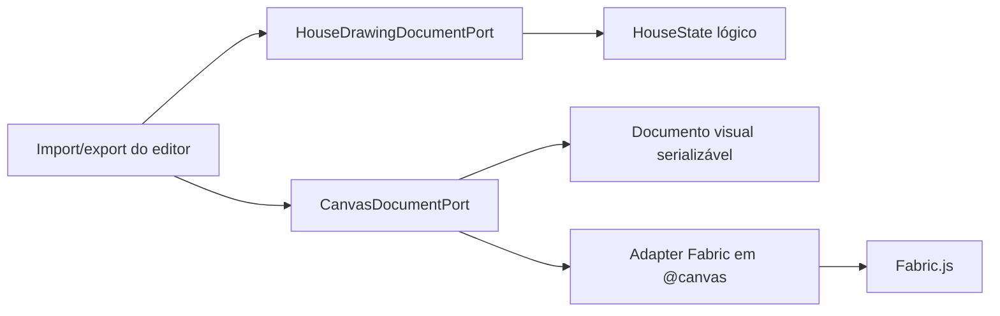

# ADR-002 — Formato Canônico do Projeto RAC

## 1. Contexto

O editor RAC ainda tinha importação e exportação orientadas pelo JSON do canvas. Isso mantinha o Fabric como contrato
operacional do projeto, mesmo depois da separação entre `HouseStatePort`, `HouseRuntimeSnapshotPort<TGroup>` e
`HouseVisualRuntimePort<TGroup>`.

A decisão de produto é tratar o arquivo exportado como documento RAC versionado, não como dump do runtime visual. Como
não há requisito de compatibilidade com arquivos JSON Fabric antigos, a migração pode rejeitar esse formato e começar com
um contrato novo.

## 2. Decisão

O formato canônico inicial do editor passa a ser `HouseDrawingDocument`.

Ele contém:

- `documentType` e `schemaVersion`, para identificar o contrato do arquivo.
- `setup`, com metadados editáveis da casa ativa.
- `house`, com o `HouseState` lógico.
- `canvas`, com um documento visual serializável composto por elementos, formas, geometria, estilo e metadados JSON.

O JSON Fabric bruto não é mais formato aceito para importação de projeto. O adapter Fabric pode converter internamente
entre o runtime visual e o documento visual, mas o hook de importação/exportação e os ports do editor não conhecem
`canvas.toJSON()`, `canvas.loadFromJSON()` nem tipos concretos do canvas.

## 3. Fronteira

## 4. Critério de aceite

A decisão está aceita quando:

1. A exportação gera documento com `documentType: "rac-house-drawing"` e versão explícita.
2. A importação rejeita JSON Fabric antigo, como `{ "objects": [] }`.
3. O fluxo de importação aplica `HouseDrawingDocument` ao estado lógico sem chamar rebuild lógico a partir do canvas.
4. `CanvasGroup` e `CanvasObject` permanecem confinados a `src/components/rac-editor/@canvas`.
5. Testes de fronteira, ports e import/export caracterizam o novo contrato.

## 5. Alternativas rejeitadas

### Manter JSON Fabric como contrato do projeto

Foi rejeitada porque perpetua o problema original: o canvas continua sendo a fonte canônica e o documento fica acoplado
ao runtime gráfico.

### Empacotar JSON Fabric dentro de um campo opaco

Foi rejeitada como solução final porque troca o nome do acoplamento, mas não sua natureza. Durante a transição, o adapter
Fabric ainda pode reconstruir formas visuais, mas o contrato público deve permanecer estruturado por elementos, geometria,
estilo e metadados serializáveis.

### Implementar `ProjectDocument` multicasa completo agora

Foi adiada. O PRD multicasa aponta nessa direção, mas o corte atual precisa estabilizar primeiro o documento da casa
ativa e o fluxo de importação/exportação do editor.

## 6. Consequências

- O arquivo exportado deixa de ser compatível com JSON Fabric antigo.
- `rebuildHouseFromCanvas` permanece como ferramenta transitória para outros fluxos, mas sai do caminho de importação do
  documento canônico.
- O próximo ciclo natural é promover o documento da casa para dentro de um `ProjectDocument` multicasa quando a camada de
  projeto estiver pronta para persistência real.

## 7. Referências

- `docs/architecture-decisions/ADR-001-fronteira-editor-runtime-fabric.md`
- `docs/product-requirements/PRD-001-evolucao-multicasa.prd.md`
- `docs/engineering-playbook/PLAY-006-ports-and-adapters.md`
- `src/shared/types/house-drawing-document.ts`
- `src/components/rac-editor/ports/HouseDrawingDocumentPort.ts`
