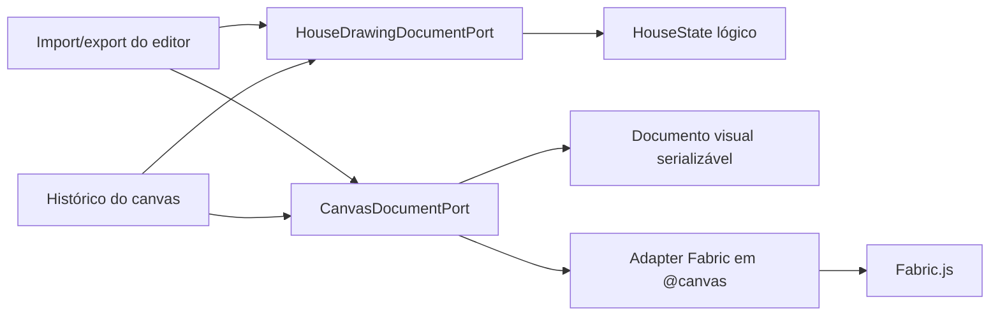

# ADR-002 — Formato Canônico Inicial do Arquivo RAC

## 1. Contexto

O editor RAC ainda tinha importação e exportação orientadas pelo JSON do canvas. Isso mantinha o Fabric como contrato
operacional do arquivo exportado, mesmo depois da separação entre `HouseStatePort`,
`HouseRuntimeSnapshotPort<TGroup>` e `HouseVisualRuntimePort<TGroup>`.

A decisão de produto para esta fase é tratar o arquivo exportado como documento RAC versionado, não como dump do runtime
visual. Como não há requisito de compatibilidade com arquivos JSON Fabric antigos, a migração pode rejeitar esse formato
e começar com um contrato novo.

Esta ADR não implementa `ProjectDocument` multicasa. O escopo aceito é o documento inicial da casa ativa, suficiente
para remover o JSON Fabric bruto do contrato público de importação/exportação.

## 2. Decisão

O formato canônico inicial do editor passa a ser `HouseDrawingDocument`.

Ele contém:

- `documentType` e `schemaVersion`, para identificar o contrato do arquivo.
- `setup`, com metadados editáveis da casa ativa.
- `house`, com o `HouseState` lógico validado estruturalmente.
- `canvas`, com um documento visual serializável composto por elementos, formas, geometria, estilo e metadados JSON.

O JSON Fabric bruto não é mais formato aceito para importação de projeto. O adapter Fabric pode converter internamente
entre o runtime visual e o documento visual, mas hooks de aplicação, ports do editor, bootstrap e documentos de domínio
não conhecem `canvas.toJSON()`, `canvas.loadFromJSON()` nem tipos concretos do canvas.

O histórico do canvas também deve restaurar o estado lógico por documento explícito quando a casa existir. Recriar
estado de casa a partir de grupos visuais deixa de ser mecanismo de aplicação aceito nesta fase.

## 3. Fronteira

## 4. Critério de aceite

A decisão está aceita quando:

1. A exportação gera documento com `documentType: "rac-house-drawing"` e versão explícita.
2. A importação rejeita JSON Fabric antigo, como `{ "objects": [] }`.
3. O fluxo de importação aplica `HouseDrawingDocument` ao estado lógico sem chamar rebuild lógico a partir do canvas.
4. `CanvasGroup` e `CanvasObject` permanecem confinados a `src/components/rac-editor/@canvas`.
5. `canvas.toJSON()` e `canvas.loadFromJSON()` não vazam para hooks de aplicação, bootstrap, ports gerais ou domínio.
6. O parser documental valida `HouseState`, setup, geometria, metadados JSON e elementos visuais sem aceitar payload
   opaco.
7. Existe round trip mínimo `canvas -> HouseDrawingDocument.canvas -> canvas` preservando identidade e metadados visuais.
8. Não existe porta pública de aplicação para `rebuildHouseFromCanvas`.
9. Testes de fronteira, ports, parser documental, adapter Fabric e import/export caracterizam o novo contrato.

## 5. Alternativas rejeitadas

### Manter JSON Fabric como contrato do projeto

Foi rejeitada porque perpetua o problema original: o canvas continua sendo a fonte canônica e o documento fica acoplado
ao runtime gráfico.

### Empacotar JSON Fabric dentro de um campo opaco

Foi rejeitada como solução final porque troca o nome do acoplamento, mas não sua natureza. Durante a transição, o adapter
Fabric ainda pode reconstruir formas visuais, mas o contrato público deve permanecer estruturado por elementos,
geometria, estilo e metadados serializáveis.

### Implementar `ProjectDocument` multicasa completo agora

Foi adiada. O PRD multicasa aponta nessa direção, mas o corte atual precisa estabilizar primeiro o documento da casa
ativa e o fluxo de importação/exportação do editor.

## 6. Consequências

- O arquivo exportado deixa de ser compatível com JSON Fabric antigo.
- O documento visual ainda é reconstruído pelo adapter Fabric dentro de `@canvas`; isso é borda legítima, não contrato de
  aplicação.
- O histórico deixa de depender de rebuild canvas -> casa e passa a armazenar documento visual mais documento lógico
  quando a casa já existe.
- O próximo ciclo relacionado a persistência só deve promover `ProjectDocument` multicasa quando a camada de projeto
  estiver pronta para persistência real.

## 7. Referências

- `docs/architecture-decisions/ADR-001-fronteira-editor-runtime-fabric.md`
- `docs/product-requirements/PRD-001-evolucao-multicasa.prd.md`
- `docs/engineering-playbook/PLAY-006-ports-and-adapters.md`
- `src/shared/types/house-drawing-document.ts`
- `src/components/rac-editor/ports/HouseDrawingDocumentPort.ts`
- `src/components/rac-editor/@canvas/ports/CanvasDocumentPort.ts`
- `src/components/rac-editor/ports/HouseWritePort.ts`
