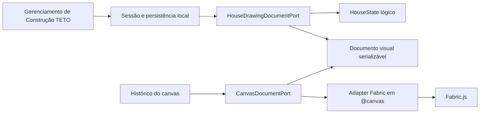

# ADR-002 - Documento Canônico da Casa RAC

## 1. Contexto

O editor RAC já teve importação e exportação orientadas pelo JSON do canvas. Isso mantinha o Fabric
como contrato operacional, mesmo depois da separação entre `HouseStatePort`,
`HouseRuntimeSnapshotPort<TGroup>` e `HouseVisualRuntimePort<TGroup>`.

A evolução multicasa da PRD-001 removeu importação/exportação JSON da navegação principal. O
documento da casa continua necessário, mas agora como contrato interno de persistência e restauração
do último estado da casa ativa no banco local.

Esta ADR não define um documento completo de Construção TETO. O escopo aceito é o documento da casa
ativa, suficiente para persistir estado lógico e visual sem transformar JSON Fabric bruto em fonte
de verdade.

## 2. Decisão

O formato canônico interno do editor é `HouseDrawingDocument`.

Ele contém:

- `documentType` e `schemaVersion`, para identificar o contrato.

- `setup`, com metadados editáveis da casa ativa.

- `house`, com o `HouseState` lógico validado estruturalmente.

- `canvas`, com um documento visual serializável composto por elementos, formas, geometria, estilo e
  metadados JSON.

O JSON Fabric bruto não é formato de persistência da aplicação. O adapter Fabric pode converter
internamente entre o runtime visual e o documento visual, mas hooks de aplicação, ports do editor,
bootstrap e documentos de domínio não devem conhecer `canvas.toJSON()`, `canvas.loadFromJSON()` nem
tipos concretos do canvas.

## 3. Fronteira

## 4. Critério De Aceite

A decisão está aceita quando:

1. O estado da casa ativa é persistido como `HouseDrawingDocument` versionado.

2. A restauração aplica `HouseDrawingDocument` ao estado lógico sem chamar rebuild lógico a partir
   do canvas.

3. `CanvasGroup` e `CanvasObject` permanecem confinados a `src/components/rac-editor/@canvas`.

4. `canvas.toJSON()` e `canvas.loadFromJSON()` não vazam para hooks de aplicação, bootstrap, ports
   gerais ou domínio.

5. O parser documental valida `HouseState`, setup, geometria, metadados JSON e elementos visuais sem
   aceitar payload opaco.

6. Existe round trip mínimo `canvas -> HouseDrawingDocument.canvas -> canvas` preservando identidade
   e metadados visuais.

7. Não existe porta pública de aplicação para `rebuildHouseFromCanvas`.

## 5. Alternativas Rejeitadas

### Manter JSON Fabric como contrato de persistência

Foi rejeitada porque perpetua o problema original: o canvas continua sendo a fonte canônica e o
documento fica acoplado ao runtime gráfico.

### Empacotar JSON Fabric dentro de um campo opaco

Foi rejeitada como solução final porque troca o nome do acoplamento, mas não sua natureza. Durante a
transição, o adapter Fabric ainda pode reconstruir formas visuais, mas o contrato da aplicação deve
permanecer estruturado por elementos, geometria, estilo e metadados serializáveis.

### Reintroduzir importação/exportação JSON como navegação principal

Foi rejeitada pela PRD-001. O compartilhamento futuro pode existir, mas não deve ser o mecanismo
principal para salvar o estado da casa nem para alternar Construções TETO.

## 6. Consequências

- O documento visual ainda é reconstruído pelo adapter Fabric dentro de `@canvas`; isso é borda
  legítima, não contrato de aplicação.

- A persistência da casa ativa passa pela sessão da Construção TETO e pelo `HouseDrawingDocument`.

- O histórico não deve depender de rebuild canvas -> casa.

- Um formato futuro de exportação consolidada deve ser desenhado como fluxo próprio, não como
  retorno do JSON Fabric.

## 7. Referências

- `docs/architecture-decisions/ADR-001-fronteira-editor-runtime-fabric.md`
- `docs/product-requirements/PRD-001-evolucao-multicasa.prd.md`
- `docs/engineering-playbook/PLAY-006-ports-and-adapters.md`
- `src/shared/types/house-drawing-document.ts`
- `src/components/rac-editor/ports/HouseDrawingDocumentPort.ts`
- `src/components/rac-editor/@canvas/ports/CanvasDocumentPort.ts`
