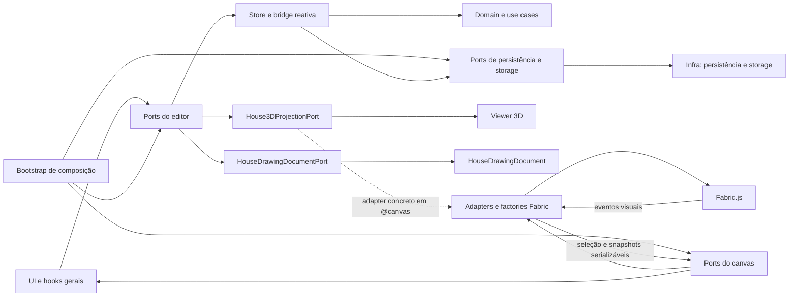

# Ports and Adapters no Editor RAC

## Objetivo

Este documento transforma a conversa sobre Ports and Adapters em uma disciplina concreta para o repositório. Ele não
trata o material legado como verdade pronta: a regra aqui é reconstruir o problema a partir do código atual, separar
fatos, hipóteses e decisões, e orientar ciclos futuros com critérios de corte.

Ports and Adapters, neste projeto, não significa criar uma arquitetura hexagonal completa por cerimônia. Significa
controlar quais partes do editor podem conhecer detalhes concretos de Fabric, canvas, persistência, store e runtime
visual.

## Problema arquitetural reconstruído

O editor RAC nasceu em torno de um runtime visual poderoso. Isso é legítimo: Fabric.js resolve desenho 2D, seleção,
objetos, histórico e interação espacial. O problema aparece quando o runtime deixa de ser detalhe de borda e passa a ser
linguagem comum do produto.

Quando objetos de canvas entram em hooks gerais, estado compartilhado, adapters de casa, viewer 3D ou domínio, os testes
passam a depender de dublês visuais, mudanças simples exigem conhecer Fabric e a decomposição de arquivos grandes vira
apenas uma mudança estética. A refatoração deve, portanto, reduzir acoplamento sem negar que o canvas ainda é uma borda
central da aplicação.

## Fatos observados no repositório

- `src/components/rac-editor` é tratado como uma miniaplicação interna do editor.
- `src/components/rac-editor/@canvas` concentra a borda visual 2D, com ports, hooks, factories e adapters Fabric.
- `src/components/rac-editor/ports` já concentra contratos internos de casa, vistas, pilotis, runtime e leitura/escrita
  lógica.
- `src/bootstrap/editor-bootstrap.ts`, `src/bootstrap/editor-house-ports.ts` e
  `src/bootstrap/editor-house-port-adapters.ts` já funcionam como pontos de composição de store e ports.
- `src/components/rac-editor/lib/editor-house-controller.ts` ainda é o controller transitório do estado compartilhado da casa.
- `src/components/rac-editor/lib/editor-house-*-command-service.ts` já separa comandos por responsabilidade.
- `src/components/rac-editor/lib/editor-house-state.ts` recebe `HousePersistencePort`; o adapter concreto padrão é
  composto em `src/bootstrap/editor-house-ports.ts`.
- `src/components/rac-editor/lib/project-session.ts` recebe storage por porta; a composição com `localStorage` ocorre no
  bootstrap.
- Configurações do editor e progresso do tutorial são expostos por `EditorSettingsPort` e `TutorialProgressPort`, com
  composição concreta em `src/bootstrap/editor-infra-ports.ts`.
- `src/components/rac-editor/lib/house-store.ts` já assina ports injetados e separa snapshot lógico de snapshot de
  runtime visual.
- `src/shared/types/house-drawing-document.ts` define o `HouseDrawingDocument`, contrato canônico inicial de
  importação/exportação da casa ativa.
- `src/components/rac-editor/ports/HouseDrawingDocumentPort.ts` compõe o documento lógico da casa sem expor JSON Fabric
  aos hooks gerais do editor.
- `src/components/rac-editor/@canvas/ports/CanvasDocumentPort.ts` representa documento visual serializável, não dump do
  runtime Fabric.
- `src/components/rac-editor/hooks/useHouseDrawingDocumentActions.ts` é o hook de aplicação para importar/exportar o
  arquivo RAC canônico da casa ativa.
- `src/test/rac-editor-boundary.smoke.test.ts` já protege o núcleo lógico contra Fabric, `@canvas`,
  `CanvasGroup`, `CanvasObject`, reintrodução de `CanvasInteractionPort` e imports concretos de `src/infra` no código
  produtivo do editor.
- `docs/architecture-decisions/ADR-001-fronteira-editor-runtime-fabric.md` já aceita a fronteira do editor com o runtime
  Fabric como decisão arquitetural vigente.
- O relatório estrutural em `graphify-out/GRAPH_REPORT.md` apontava `HouseManagerFacade`, `HouseAggregate`,
  `useRacEditorController` e `RacEditor` como nós de alto acoplamento. Esse relatório é índice derivado, não fonte
  canônica.

## Hipóteses de trabalho

- O controller transitório da casa pode deixar de ser o centro permanente do editor, mas deve ser reduzido por responsabilidades, não
  removido em big bang.
- Um modelo serializável de documento da casa deve diminuir a necessidade de reconstruir estado lógico a partir de
  grupos visuais.
- Nem todo uso de `CanvasGroup` é problema. Dentro de `@canvas`, ele pode ser parte legítima do runtime visual.
- Um novo port só melhora a arquitetura quando reduz acoplamento real, melhora teste ou permite troca concreta de
  implementação. Um port que apenas renomeia método de Fabric é custo sem benefício.
- Casos de uso continuam fazendo sentido no domínio quando expressam regra pura, transformação ou invariante testável.

## Decisões vigentes

- Fabric, `CanvasGroup` e `CanvasObject` pertencem ao slice `@canvas`, especialmente a factories, helpers visuais,
  runtime e adapters.
- Código em `domain`, `shared`, `infra`, `src/components/rac-editor/ports` e `src/components/rac-editor/lib` não deve
  importar Fabric nem tipos concretos do canvas.
- Ports devem representar capacidades semânticas do editor, não a API da biblioteca usada por baixo.
- Adapters Fabric ficam em `src/components/rac-editor/@canvas`, principalmente em `@canvas/ui/adapters`.
- Adapters transitórios que compõem o controller da casa com ports do editor ficam no bootstrap, enquanto ele ainda for
  a fonte de coordenação.
- Persistência, storage local e integrações técnicas não visuais pertencem a `src/infra`.
- Código de estado do editor pode depender de `HousePersistencePort`, mas não deve instanciar adapters concretos de
  persistência.
- Serviços de sessão/projeto no núcleo do editor podem depender de portas de storage, mas não devem importar
  `src/infra/storage` diretamente.
- Hooks, UI e adapters visuais do editor podem depender de `EditorSettingsPort` e `TutorialProgressPort`, mas não devem
  importar `src/infra/settings` nem `src/infra/storage/tutorial.storage` diretamente.
- `HouseStatePort` representa estado lógico; `HouseRuntimeSnapshotPort<TGroup>` representa projeção visual observável;
  `HouseVisualRuntimePort<TGroup>` representa capacidades mínimas do runtime visual.
- `CanvasInteractionPort` foi removido. O componente `Canvas` expõe `RacEditorCanvasHandle` como composição de tela, e
  consumidores novos devem escolher handles menores.
- `src/components/rac-editor/hooks/useRacEditorController.ts` e
  `src/components/rac-editor/ui/RacEditorCanvas.tsx` usam `RacEditorCanvasHandle`, um composite explícito de
  capacidades menores.
- `src/bootstrap/editor-house-port-adapters.ts` deve permanecer genérico sobre `HouseRuntimeGroupRef`; adapters que
  precisam interpretar `CanvasGroup`, como a projeção 3D concreta, pertencem ao slice `@canvas`.
- `House3DProjectionPort` é a fronteira do viewer 3D. O viewer recebe projeção serializável e não deve depender de
  `HouseRuntimeSnapshot<TGroup>`, `CanvasGroup`, `CanvasObject` ou `useHouseRuntimeSnapshot`.
- `HouseDrawingDocument` é o contrato canônico inicial de arquivo do editor. Ele junta `HouseState`, setup da casa ativa
  e documento visual serializável.
- JSON Fabric bruto não é formato de projeto. O adapter Fabric pode converter internamente o documento visual, mas hooks,
  ports do editor e bootstrap não devem depender de `canvas.toJSON()` ou `canvas.loadFromJSON()` como contrato público.
- `HouseCanvasReconciliationPort` foi removido. Histórico, importação e restauração devem aplicar documento lógico
  explícito quando houver casa ativa, não reconstruir estado a partir de grupos visuais.
- `rebuildHouseFromCanvas` não deve voltar como caminho de aplicação sem nova decisão arquitetural explícita.
- O parser de `HouseDrawingDocument` deve rejeitar payload visual opaco, `HouseState` incompleto, geometrias inválidas e
  metadados que não sejam JSON.

## Mapa de fronteiras



## Regra prática para criar ports

Crie ou mantenha um port quando pelo menos uma das condições for verdadeira:

1. O consumidor precisa ser testado sem carregar Fabric, browser API ou singleton.
2. A implementação concreta pode mudar no curto ou médio prazo.
3. O contrato expressa uma intenção de negócio ou editor, e não um detalhe visual.
4. O port reduz uma dependência que hoje cruza uma fronteira protegida.

Não crie port quando:

1. Ele apenas repete o nome de um método de Fabric.
2. Não existe consumidor real.
3. Não existe adapter concreto ou fake útil para teste.
4. A responsabilidade pertence exclusivamente ao runtime visual dentro de `@canvas`.

## Exemplos mínimos de artefatos

### Port semântico

```ts
export interface HouseTerrainWritePort {
    /** Define o tipo de terreno e retorna o valor normalizado efetivamente aplicado. */
    setTerrainType(terrainType: number): number;
}
```

O contrato fala de terreno, não de canvas. A normalização é efeito esperado do editor, não detalhe de Fabric.

### Adapter transitório

```ts
export function createEditorHouseTerrainPort(source: {
    setTerrainType(terrainType: number): number;
}): HouseTerrainWritePort {
    return {
        setTerrainType: (terrainType) => source.setTerrainType(terrainType),
    };
}
```

Esse tipo de adapter é aceitável como ponte temporária quando o código consumidor já pode depender do port e o
controller transitório da casa ainda é a implementação real.

### Guarda arquitetural

```ts
expect(violations).toEqual([]);
```

A guarda deve verificar dependências proibidas, não formato interno arbitrário. Se a regra arquitetural é relevante, ela
merece teste.

## Plano enxuto de continuidade

### 1. Consolidar baseline mensurável

Objetivo: saber exatamente o que ainda cruza fronteiras.

Resultado esperado:

- Lista atualizada de imports de `CanvasGroup`, `CanvasObject`, Fabric e qualquer tentativa de reintroduzir
  `CanvasInteractionPort`.
- Classificação por local legítimo, tolerado temporariamente ou proibido.
- Teste arquitetural ajustado quando uma regra virar decisão.

Critério de corte:

- Só avançar quando cada vazamento tiver destino explícito: manter, migrar ou transformar em regra protegida.

### 2. Reduzir dependência ampla do canvas

Objetivo: impedir que hooks e componentes usem o handle completo do canvas por conveniência.

Resultado esperado:

- Consumidores dependendo de handles específicos.
- `CanvasInteractionPort` removido e substituído por handles específicos ou por `RacEditorCanvasHandle` na composição
  de tela.
- Novas capacidades criadas apenas quando houver consumidor real.

Critério de corte:

- Nenhum arquivo produtivo reintroduz ou importa `CanvasInteractionPort`.

### 3. Separar estado lógico de runtime visual

Objetivo: garantir que a UI leia estado lógico quando não precisa do canvas.

Resultado esperado:

- Fluxos de menus, modais e viewer 3D escolhendo explicitamente entre `HouseStatePort` e
  `HouseRuntimeSnapshotPort<TGroup>`.
- Snapshots lógicos sem objetos mutáveis compartilhados de forma perigosa.
- Testes de hooks usando ports fake em vez de singleton.

Critério de corte:

- Uma mudança de teste consegue trocar os ports do provider sem tocar no singleton padrão.

### 4. Reduzir o controller da casa por responsabilidade

Objetivo: transformar o manager em composição transitória até que sua existência deixe de ser necessária.

Resultado esperado:

- Comandos de setup, terreno, vistas e pilotis continuam isolados.
- Regras puras migram para use cases ou domínio quando não dependem de runtime visual.
- Efeitos visuais permanecem em adapters de canvas.

Critério de corte:

- Cada ciclo remove uma responsabilidade real do manager ou estreita seu contrato público.

### 5. Definir o documento serializável da casa

Objetivo: reduzir a dependência de reconstrução lógica a partir do canvas.

Resultado esperado:

- Forma inicial de documento serializável para casa, setup da casa ativa e elementos desenhados.
- Round trip mínimo de exportação/importação caracterizado por teste.
- Rebuild visual tratado como projeção, não como fonte primária de verdade.
- JSON Fabric antigo rejeitado como formato de projeto.

Critério de corte:

- Import/export têm teste que preserva identidade lógica de casa e rejeita JSON Fabric bruto.
- O documento visual pode ser reconstruído pelo adapter Fabric, mas o contrato do editor permanece estruturado e
  versionado.
- O round trip mínimo `canvas -> HouseDrawingDocument.canvas -> canvas` preserva identidade de elemento e metadados
  editoriais.
- `canvas.toJSON()` e `canvas.loadFromJSON()` permanecem confinados ao slice `@canvas`.

### 6. Remover pontes transitórias apenas quando ficarem ocas

Objetivo: evitar tanto o apego ao legado quanto a remoção teatral.

Resultado esperado:

- Adapters transitórios do bootstrap removidos somente quando não tiverem mais comportamento.
- O controller da casa removido apenas se virar simples fachada sem estado próprio relevante.
- ADR-001 revisado se a fronteira final mudar de fato.

Critério de corte:

- A remoção reduz código e acoplamento sem introduzir nova fonte paralela de verdade.

## Riscos e mitigação

| Risco                                | Impacto                                                   | Mitigação                                                                 |
|--------------------------------------|-----------------------------------------------------------|---------------------------------------------------------------------------|
| Criar ports demais                   | Aumenta cerimônia e dificulta navegação                   | Exigir consumidor, adapter e ganho de teste                               |
| Remover o controller cedo demais      | Quebra fluxos de casa, vistas, terreno e contraventamento | Migrar por responsabilidade, com teste por fatia                          |
| Tratar canvas como estado canônico   | Import/export e viewer 3D ficam frágeis                   | Separar estado lógico, runtime snapshot e projeção visual                 |
| Duplicar fontes de verdade           | UI e canvas passam a divergir silenciosamente             | Um ciclo só pode criar store nova se remover ou substituir a fonte antiga |
| Transformar documentação em promessa | O repositório passa a documentar arquitetura imaginária   | Documentar sempre como fato, hipótese ou decisão                          |

## Critério de parada da refatoração

Esta refatoração deve parar quando todos os itens abaixo forem verdadeiros:

1. As fronteiras protegidas continuam verdes no teste arquitetural.
2. Hooks gerais e UI de alto nível não conhecem Fabric nem tipos concretos do canvas.
3. Fluxos de casa leem estado lógico por `HouseStatePort` quando não precisam de runtime visual.
4. O controller da casa não concentra regras puras que deveriam estar no domínio nem efeitos visuais que deveriam estar no
   canvas.
5. Import/export, vistas, piloti, terreno, contraventamento e viewer 3D têm testes suficientes para impedir
   regressão nos fluxos críticos.
6. O uso remanescente de `CanvasGroup` está confinado ao slice `@canvas`.
7. `HouseDrawingDocument` possui validação estrutural e round trip mínimo coberto por teste.
8. `rebuildHouseFromCanvas` não existe como porta pública nem como fluxo produtivo de aplicação.
9. Novos ciclos de refatoração só entram se apontarem um acoplamento real, uma dor de teste ou um risco funcional.

Se esses critérios forem satisfeitos, continuar mexendo apenas para deixar a arquitetura "mais pura" é vaidade técnica.
Elegante, talvez; útil, nem sempre.
